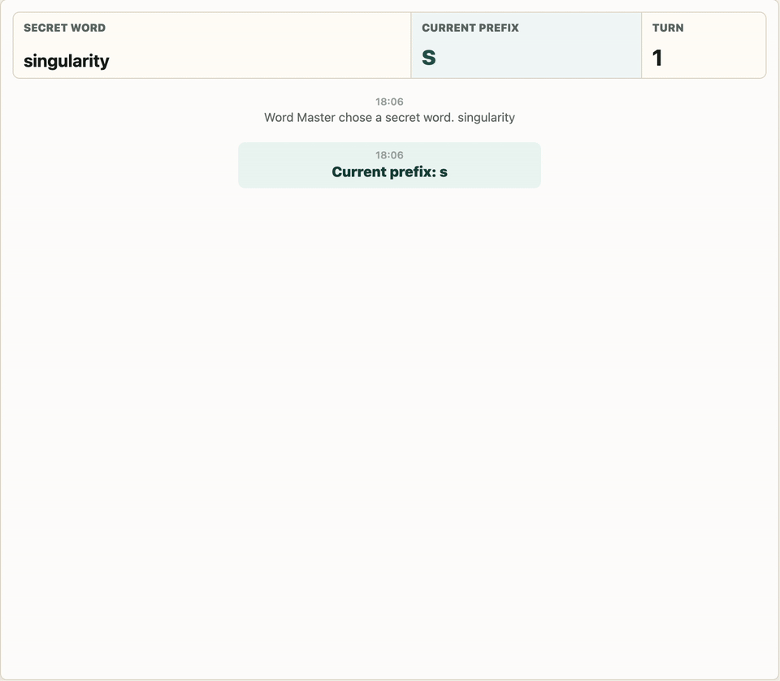
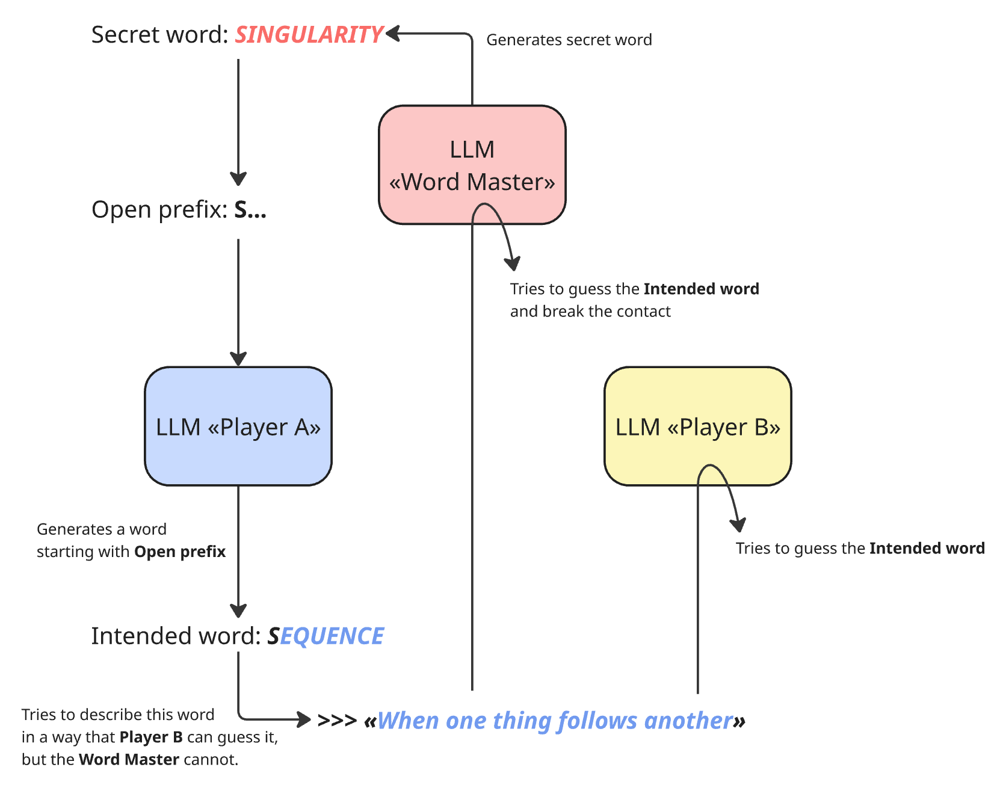

# AI Contact Game


A small LLM-agent experiment inspired by the Russian word game **"Есть контакт" / "Contact"**.

The game has three modes:

- **AI vs AI**: the Word Master, Player A, and Player B are all AI agents.
- **Play as Word Master**: you provide the secret word and try to intercept the AI players' clues.
- **Play as Player A**: you create clues on your turns and guess Player B's clues, while the secret word stays hidden from you.

The project is intentionally small: Python runs the game rules, validation, turn loop, and AI calls; React renders the UI and sends human inputs back to the backend.

## Rules

In the original game, a Word Master thinks of a word and reveals its first letter. Other players give clue-like definitions for different words that start with the revealed letter or prefix. If another player understands the clue, they announce contact; the Word Master has a chance to guess and block it. If the players name the same word, the Word Master reveals the next letter. The round ends when the secret word is named.

This project adapts that structure for LLM agents and optional human roles. The backend pauses the game when a human move is needed, validates the submitted word or clue, then resumes the same turn flow.

## Demo



## LLM Interaction Schema



## Repository

GitHub: [fomin-n/ai-contact-game](https://github.com/fomin-n/ai-contact-game)

## Stack

- Backend: Python, FastAPI
- Frontend: React, TypeScript, Vite
- AI providers: Mistral by default, OpenAI-compatible providers supported
- Game state: in-memory backend state

## Quick Start

Create a local environment file:

```bash
cp .env.example .env
```

Fill in at least one API key in `.env`, then run everything with one command:

```bash
./scripts/dev.sh
```

The script installs Python and Node dependencies, starts the FastAPI backend, starts the Vite frontend, and prints the local URL.

Open:

```text
http://127.0.0.1:5173
```

Ports can be changed in `.env` or for a single run:

```bash
BACKEND_PORT=9000 FRONTEND_PORT=5174 ./scripts/dev.sh
```

To install dependencies without starting servers:

```bash
./scripts/dev.sh --install-only
```

## Choosing AI Models

Set provider API keys in `.env`, start the app, then use **Settings → AI Models**.
Each AI role (Word Master, Player A, Player B) can be assigned its own model.

API keys are configured in `.env` only and are never entered or shown in the web UI.

## Useful Commands

```bash
cd frontend
npm run typecheck
npm run build
cd ..
.venv/bin/python -m compileall backend
```

## Telegram Bot

A Telegram bot interface is included that shares the same game engine. Users can play in Russian or English as Word Master or Player A, against AI opponents.

### Supported modes

- **Play as Word Master**: enter a secret word, see AI players produce clues, try to intercept them.
- **Play as a Player**: give encrypted clues on your turn; guess Player B's encoded word when contact is attempted.

### Commands

| Command | Description |
|---|---|
| `/start` or `/newgame` | Start a new game (language + role selection) |
| `/rules` | Show the game rules |
| `/status` | Show current game state |
| `/cancel` | Cancel the active game |

### Local run

Add to `.env`:
```bash
AI_CONTACT_TELEGRAM_BOT_TOKEN=your_bot_token
```

Run the bot:
```bash
.venv/bin/python -m backend.telegram.bot
```

### Deployment

The bot runs as a systemd service on the VPS:
```bash
./deploy/scripts/deploy.sh
```

Service management:
```bash
sudo systemctl status ai-contact-game
sudo journalctl -u ai-contact-game -f
sudo systemctl restart ai-contact-game
```

### Observability

Traces are sent to Arize Phoenix when `ENABLE_PHOENIX_TRACING=true`. Access the Phoenix UI via SSH port forwarding:
```bash
ssh -L 6006:127.0.0.1:6006 user@host -N
```
Then open `http://localhost:6006` and select the `ai-contact-game-bot` project.

### MVP limitations

- In-memory sessions: active games are lost on service restart (users can `/newgame`).
- Private chats only.
- Model and provider configuration is server-side only (no per-user selection).

## Notes

- Do not commit `.env*`, runtime logs, `.venv`, `node_modules`, or `dist`.
- Detailed engineering notes for coding agents live in [AGENTS.md](./AGENTS.md).
